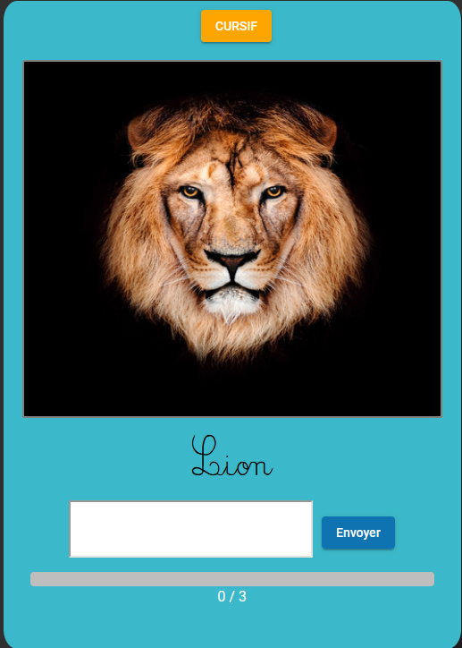

  <link rel="stylesheet" href="https://use.fontawesome.com/releases/v6.1.1/css/all.css">
<h1 align=center>Ajouter un jeu dans l'application</h1> 
<p align=center><i class='fa-solid fa-exclamation-triangle fa-lg' style='color : yellow'></i> Tout ce qui suit doit être réaliser dans l'application <i class="fa-brands fa-angular" style="color : #dd0031"></i> Angular.
</p>
<span align=center>Nous avons utiliser <b>boostrap 4.0</b> et <b>angular material</b> pour le front du projet en grande partie vous pouvez donc allez piocher des styles directement depuis ces librairie pour le rendu front de votre jeu.</span>
<p>Dans le cas d'une intérogation je vous conseille de regardez les autres componenent de jeu dans le dossier source (Angular).</p>

<p> <i class="fa-solid fa-exclamation-circle fa-lg" style='color : yellow'></i> Si votre jeu doit contenir des images : créer une liste d'<a href="../src/app/Image.ts"><b><i>Image</i></b></a> qui contiendra le resultat de la méthode <b><u>recup</u></b> du component <a href="../src/app/images/images.component.ts"><b><i>images.componenent.ts</i></b></a> qui ira chercher les images dans la BDD.</p>

<hr>

<p align=center></p>

<h2 align=center>Etape 1 : Créer le component pour le jeu</h2>
Rendez vous dans la racine du projet dans un shell et tapez la commandes quit suit

```sh
$ ng generate c {NOM_DU_JEU}
```

Après avoir fait cette commande un nouveau dossier dans '<b>/src/app/{NOM_DU_JEU}</b>' devrait avoir été créer


- Le fichier <b>CSS</b> permet de gérer le style du component
- Le fichier <b>HTML</B> permet de gérer le contenu du component
- Le fichier <b>TS</b> permet d'incluce le **TypeScript** du component

Pour <b>appeler</b> ce component depuis un autre vous devez utiliser le code qui suit

<div id="appel">

```html
  <app-nom-du-jeu></app-nom-du-jeu>
```
</div>

<h2 align=center>Etape 2 : Créer le jeu</h2>

La création du jeu est une chose a faire de vous même mais je vous met a disposition des partie de code que vous pouvez reutilisez.

<h3 align=center>Le titre</h3>

####  Le style css du titre
```css
.title {
  font-size: 105px;
  font-weight: bold;
  letter-spacing: 6px;
  text-shadow: rgb(0, 0, 0, 0.7) 5px 8px;
}

.title :nth-child(1n) {
  color: #835ba7;
}
.title :nth-child(2n) {
  color: #3e4194;
}
.title :nth-child(3n) {
  color: #01afee;
}
.title :nth-child(4n) {
  color: #00a656;
}
.title :nth-child(5n) {
  color: #fff116;
}
.title :nth-child(6n) {
  color: #f68635;
}
.title :nth-child(7n) {
  color: #ec3238
}
.title :nth-child(8n) {
  color: #835ba7
}
```

#### Le code du titre
```html
<div class="text-center" *ngIf="this.showTitle">
  <h1 class="title">
    <span>R</span>
    <span>E</span>
    <span>C</span>
    <span>O</span>
    <span>P</span>
    <span>I</span>
    <span>E</span>
    <span>R</span>
  </h1>
</div>
```

A notez qu'il faut que vous rajoutez le code qui suit dans le **.ts** pour désactiver ou non l'affichage du titre lors de l'appel du componenent (nous utiliserons cette fonctionalité dans le panel pour faire afficher la prévisualisation du jeu ou l'affichage de la liste et du formulaire de création / édition du jeu)

```ts
  @Input() showTitle: boolean = true;
```

<h3 align=center>Le jeu</h3>
Nous vous mettons à disposition du style CSS utilisable

#### Boite de jeu
```css
.card_play {
  width: 50%;
  border-radius: 3%;
  padding: 10px;
  box-shadow: hsl(0deg 0% 0% / 40%) 10px 15px;
  color: white;
}

.image_play {
  border: solid grey 2px;
  width : 490px;
  display: inline;
}
```
***Exemple :***

<div align=center>

</div>
<p>Le cadre bleu ci-contre est le résultat de ce style.

Nous utilisons le style des cadres **boostrap** vous pouvez donc utiliser le code qui suit pour agencer les élements de votre jeu</p>

```html
<div class="card_play align-middle text-center container">

</div>
```

<h3 align=center>La liste des jeux</h3>

- <p>Une fois votre jeu terminé vous devez créer une classe avec les attributs de votre jeu qui le rendront personalisable (couleur de background , couleur de texte, police d'écriture,ect...)
</p>
<p><i class="fa-solid fa-exclamation-circle fa-lg" style='color : yellow'></i>
Votre classe doit contenir les deux attributs suivant !</p>

```ts
  id: number;
  date: string;
```

- <p>Vous devez ensuite créer une table dans la base de données correspondant à votre jeu</p>

***Exemple***


<p></p>

- <p>Vous devez créer le fichier <b>PHP</b> correspondant à la récupération des données (vue) </p>

```php
<?php
header("Access-Control-Allow-Origin: http://localhost:4200");
header("Access-Control-Allow-Methods: PUT, GET, POST, DELETE");
header("Access-Control-Allow-Headers: Origin, X-Requested-With, Authorization, Content-Type, Accept");
require_once("connection.php");
$conn = new Connection();
$result;
$myArray=array();

    $sql = "SELECT * FROM {NOM_DE_LA_TABLE}";
    $result = $conn->db->query($sql);
    
        while($row = $result->fetch(PDO::FETCH_ASSOC)){
            $myArray[] = $row;
        }
    
    $myJSON = json_encode($myArray);
    echo $myJSON;
?>
```

- <p>Vous devez ensuite ajoutez dans votre fichier <b>.ts</b> les fonctions de récupération et d'envoie dans la base de données</p>

<div id="recup"></div>

***Récupération***
```ts
recup(tab: any) {//Récupére le jeu depuis la BDD
    this.jeuxService.recup_recopier(tab).subscribe(data => {
      for (var i = 0; data[i] != null; i++) {
        if (data[i].id_crea == +localStorage.getItem('id_crea')!) {
          tab.push(
            //Appeler le constructeur de votre jeu
          );
        }
      }
    })
  }
```

***Insertion***

```ts
  onSend(list: any) {//Ajoute le jeu dans la BDD
    const formData: FormData = new FormData();
    formData.append('send', JSON.stringify(list));
    this.jeuxService.onSend(formData).subscribe({
      next: res => {
        this.reponse = res;
      },
    });
  }
```

***Update***

```ts
  onSend_update(list: any) {//Update le jeu dans la bdd
    const formData: FormData = new FormData();
    list['id_table']='ID_NOM_DU_JEU';//Permet de reconnaitre la table
    formData.append('update', JSON.stringify(list));
    this.jeuxService.onSend(formData).subscribe({
    });
  }
```

<div id="onSendDelete">
</div>

***Delete***

```ts
  onSend_delete(id_jeu: any) {//Suprimme un jeu de la bdd

    const formData: FormData = new FormData();
    var list={table:'NOM_DE_LA_TABLE_DU_JEU',id:id_jeu,id_table:'ID_NOM_DU_JEU'};//Permet de reconnaitre la table, le nom de l'id et le numero de l'id
    formData.append('delete', JSON.stringify(list));
    this.jeuxService.onSend(formData).subscribe({
    });
  }
```

<p>Si vous souhaitez faire afficher vos jeu vous devez dans un premier temps les récupérer depuis la bdd en faisant l'appel de la fonction <b>recup</b>. Cela se fait dans la fonction <b>ngOnInit</b> dans le fichier <b>.ts</b></p>

***Exemple***

```ts
data : NOM_DU_JEU[] = [];
ngOnInit(): void {
  this.recup(this.data);
}
```
<p><i class="fa-solid fa-exclamation-circle fa-lg" style='color : yellow'></i>
Vous devez considérez que cette action prendra un certain temps donc il est conseillez si vous souhaitez agir sur la liste récupérer de laissez le temps en utilisant la fonction <b>setTimeout</b></p>

- <p> Pour maintenant afficher la liste des jeux vous devez ajoutez le code HTML qui suit

```html
 <table class="table table-hover text-center">
        <thead>
          <tr>
            <th scope="col"
              *ngFor="let col of ['NOM_COLLONE_1',NOM_COLLONE_2','Actions']">
              {{col}}</th>
          </tr>
        </thead>

        <tbody>
          <tr *ngFor="let element of this.data">
            <th>{{element.attribut_1}}</th> <!-- element correspondant à la collone 1 -->
            <th>{{element.atrribut_2}}</th> <!-- element correspondant à la collone 2 -->

            <!-- Actions -->
            <th class="button_actions">
              <!-- Prévisualiser le jeu -->
              <button mat-raised-button title="Prévisualiser le jeu" color="primary" (click)="preview(element)">
                <i class="fa-solid fa-eye fa-lg fa-lg" style="margin-bottom : 2px"></i>
              </button>

              <!-- Editer le jeu -->
              <button mat-raised-button title="Editer le jeu" style="background-color : rgb(223, 175, 18)"
                color="primary" (click)="edit(element)">
                <i class="fa-solid fa-pen fa-lg" style=" margin-bottom : 2px"></i>
              </button>

              <!-- Supprimer le jeu -->
              <button mat-raised-button title="Supprimer le jeu" style="background-color : red" color="primary"
                (click)="delete(element)">
                <i class="fa-solid fa-trash fa-lg" style=" margin-bottom : 2px "></i>
              </button>
            </th>
          </tr>
        </tbody>
      </table>
```

<p>La collone actions contient des boutons qui appel des fonctions nécéssaire</p>

***Prévisualisation du jeu***

```ts
  preview(prev: boolean): void {
    if (prev == true) {
      this.jeu = //APPEL ICI DU CONSTRUCTEUR DU JEU AVEC LES PARAMETRES DU JEU
      this.previsualiser = true;
    }
    else {
      this.previsualiser = false;
      setTimeout(() => {
        this.setInactive(document.getElementsByClassName('breadcrumb-item')!.item(0)!.children.item(0));
        this.setActive(document.getElementsByClassName('breadcrumb-item')!.item(this.formStep)!.children.item(0));
      }, 0);
    }
  }
```
Cette fonction permet de prévisualiser le jeu avec les paramètres de celui-ci.

***Edition du jeu***

```ts
  edit(j: jeu): void {
    window.location.href = '/panel/NOM_DU_JEU/edit/' + j.id;
  }
```
<p>Cette fonction amène a une redirection qui sera géré par la page <b>Panel</b>.<br>Dans la page Panel nous gérerons l'affichage du menu d'édition tout comme celui de la liste des jeux et le formulaire de création par <a href="#appel">appel du component</a> et en modifiant l'affichage avec des variables booléenes.</p> 


***Supprésion du jeu***


```ts
  delete(j: NOM_DU_JEU): void {
    this.onSend_delete(j.id);
    this.deleteSessionjeu(j.id);
    this.deleteThemeJeu(j.id);
    setTimeout(() => {
      this.data = [];
      this.recup(this.data);
    }, 400)
  }
```
<p>Cette fonction réalise l'appel de <b>4</b> fonctions :
  <br>
  - La fonction de <a href="#onSendDelete">supprésion du jeu dans la base de donnée</a> ;
  <br>
  - La fonction de <a href="#deleteSessionJeu">suppréssion du jeu dans toutes les séssions qui comporte le jeu</a> ;
  <br>
  - La fonction <a href="#deleteThemeJeu">suppréssion du jeu dans le thème associé au jeu</a> ;

</p>

<div id="deleteSessionJeu">

>***Fonction suppréssion du jeu dans toutes les séssion***

```ts
  deleteSessionJeu(id: number): void {
    let ses: SessionsComponent = new SessionsComponent(this.router, this.route, this.jeuxService);
    for (let s of this.list_session) {
      for (let jeu of s.jeuId) {
        if (jeu.type == 'NOM_DU_JEU' && jeu.id_jeu == id) {
          this.deleteRecopier(id, s);
          this.list = { nom: s!.nom, isSuivi: +s!.isSuivi, join: +s!.isActive, id: s!.id, jeux_id: this.setJeuSession(s!.jeuId), liste_j: this.setJoueurs(s!) };
          ses.onSend_update(this.list);
        }
      }
    }
  }
```

</div>

<div id="deleteThemeJeu">

***Fonction suppréssion du jeu dans le thème associés***

```ts
  deleteThemeJeu(id: number): void {
    let theme = new ThemeComponent(this.route, this.jeuxService, this.router);
    let liste: any = [];
    theme.recup2(liste);
    let ses: SessionsComponent = new SessionsComponent(this.router, this.route, this.jeuxService);

    setTimeout(() => {
      for (let t of liste) {
        let array = ses.getJeuSession(t.id_jeux);
        let index = -1;
        for (let j of array) {
          if (j.type == 'NOM_DU_JEU') {
            if (j.id_jeu == id) {
              index = array.indexOf(j);
            }
          }
        }

        if (index > -1) {
          array.splice(index, 1);
          t.id_jeux = ses.setJeuSession(array);
          theme.onSend_update({ id_theme: t.id, id: t.id_image, id_jeux: t.id_jeux, nom: t.nom });
        }
      }
    }, 200)
  }
```
</div>

<h2 align=center>Etape 3 : Ajoutez le jeu au panel</h2>

<p>L'ajout du jeu au panel se fait en plusieurs étapes.<br>
La prémière étape consiste à ajouté dans panel la route pour l'affichage de la liste des jeux, la création et l'édition du jeu</p>

<h3 align=center>Ajout de la route</h3>

<p>Dans le fichier <a href="../src/app/panel/panel.component.ts"><b><i>panel.component.ts</i></b></a> ajoutez <u>la fonction de récupération</u> du jeu depuis la BDD (<a href="#recup">voir fonction recup</a>)

- <p>Ensuit il faut mettre en place la route. Pour cela ajoutez les lignes suivants dans la fonction <b>ngOnInit()</b></p>

```ts
this.NOM_DU_JEU_list : NOM_DU_JEU[] = [];
ngOnInit(): void {
  this.recup_NOM_DU_JEU(this.NOM_DU_JEU_list)
  ...

  else if (this.selectedGame == 'NOM_DU_JEU') {
    if (this.getNOM_DU_JEU()! == null) {
      this.router.navigate(['/panel/NOM_DU_JEU']);
    } else {
      this.NOM_DU_JEU = this.getNOM_DU_JEU();
    }
  }

  ...
}
```

- <p>Ensuite ajouter la fonction <b>getNOM_DU_JEU() dans le fichier comme suit :</b></p>

```ts
  getNOM_DU_JEU(): NOM_DU_JEU | null {
    for (let j of this.NOM_DU_JEU_list) {
      if (j.id == this.id_game) {
        return j;
      }
    }
    return null;
  }
```

- <p>On ajoute maintenant l'appel dans le <b>HTML</b> mais avant cela ajoutez les variables dans le fichier <b>.ts</b> de votre jeu afin de géré l'affichage lors de l'appel. <br>
  On ajoutera au moins les variables qui suivent</p>

  ```ts
  @Input() jeu : NOM_DU_JEU | null;
  @Input() showTitle: boolean = true; //affiche le titre du jeu
  @Input() showList: boolean = false; //Affiche la liste des jeu
  @Input() play: boolean = true;//Lance le jeu
  @Input() create_game: boolean = false;//Crée le jeu si true
  @Input() edit: boolean = false;//Va dans l'edit si true
  ```

<p>On commence par ajoutez les boutons quit permettent d'acceder au menu du jeu dans le  panel pour cela ajoutez le code quit suit dans le fichier <a href="../src/app/panel/panel.component.html"><b><i>panel.componenent.html</i></b></a></p>

```html
<nav id="nav" class="navbar navbar-expand-lg navbar-light bg-light">
...
  <li class="nav-item">
    <a class="nav-link" href="/panel/NOM_DU_JEU" role="">
      NOM_DU_JEU
    </a>
  </li>
</nav>

...

<!-- Panel - Page d'accueil -->
<div class="card container" *ngIf="this.panel == null">
...
    <!-- Jeux -->
    <div class="col-md-6">
      ...
      <i *ngIf="c == 'NOM_DU_JEU'" class="METTRE ICI LA CLASSE D'UNE ICON FONTAWESOME APPROPRIER AU JEU"></i>
      ...
    </div>

</div>

<!-- Si /panel/create -->
<div *ngIf="this.panel == 'create'">
  ...
  <button class="choice" *ngFor="let c of this.optionGame" [routerLink]="['/panel/', c,'create']" mat-raised-button color="primary">
    ...
    <i *ngIf="c == 'NOM_DU_JEU'" class="METTRE ICI LA CLASSE D'UNE ICON FONTAWESOME APPROPRIER AU JEU"></i>
    ...
  </button>
</div>

```

- <p>Ensuite, nous allons ajoutez l'appel de du formulaire de création / édition et l'affichage de la liste des jeux. <br> Ajoutez le code qui suit dans <a href="../src/app/panel/panel.component.html"><b><i>panel.component.html</a></b></i></p>

```html
<!-- Si un jeu est selectionné -->
<div *ngIf="this.selectedGame != '' && this.optionGame.includes(this.selectedGame!)">

  <div *ngIf="this.panel_option == 'create'">
    ...

    <!-- Formulaire NOM_DU_JEU -->
    <div class="card-body" *ngIf="this.selectedGame == 'NOM_DU_JEU'">
      <app-nom-du-jeu [play]="false" [showTitle]="false" [create_game]="true"></app-nom-du-jeu>
    </div>
  </div>

  <div *ngIf="this.panel_option == 'showList'">
    ...

    <div *ngIf="this.selectedGame == 'NOM_DU_JEU'">
      <app-nom-du-jeu [play]="false" [showTitle]="false" [showList]="true"></app-nom-du-jeu>
    </div>

  </div>

  <div *ngIf="this.panel_option == 'edit'">
    ...

    <!-- Formulaire édition NOM_DU_JEU -->
    <div *ngIf="this.selectedGame == 'NOM_DU_JEU'">
      <app-nom-du-jeu [play]="false" [showTitle]="false" [edit]="true" [jeu]="this.NOM_DU_JEU"></app-nom-du-jeu>
    </div>
  </div>

</div>
```

- <p>La prochaine étape consiste à ajoutez le code pour modifier les paramètre par défaut en cas d'édition. <br> Ajoutez le code qui suit dans le fichier <b>.ts</b> de votre jeu :</p>

```ts

  ngOnInit(): void {
    ...
    
    if (this.edit) {//Permet d'editer un jeu, récupere les données du jeu this.jeu!.(nom d'une variable du jeu) de NOM_DU_JEU.ts et les affiches
        this.create_game = true
        this.selectedImages = this.r!.images;
        
        //METTRE ICI LE CODE D'ASSOCIATION DES PARAM7TRE DE JEU AU VARIABLE PAR DEFAUT
        //EXEMPLE :
        this.NOM_DU_JEU_bg_color = this.jeu!.bg_color;


        this.list = //Recupere les données dans une liste pour l'update
        {
          table: 'NOM_DU_JEU', 
          attribut_nom_collonne_bdd_1: this.jeu.attribut_1, 
          id_crea: this.id_crea, 
          id: this.jeu!.id,
        };
      }
    ...
    }
```

- <p>Une fois cela fait vous devriez avoir l'affichage et la redirection sur le formulaire d'édition ou de création. <p>La partie sur le formulaire de création et d'édition étant propre au jeu je n'ai pas de fonction clair a donnez cependant je liste ici quelque partie de code qui pourrait vous être utile</p></p>

***Le code utilisé pour la sélection des images***

**.html**

```html
 <!--Formulaire Recopier Etape du formulaire 1 -- Choix des images-->
      <div class="card-body selectImage_container text-center align-top">
        <h5 class="card-header" style="color : black">Listes des images</h5>
        <figure class="figure" *ngFor="let image of this.liste_image">
          
          <figcaption class="figure-caption">{{image.getNom()}}</figcaption>
        </figure>

      </div>
      <div class="card-body selectImage_container text-center">
        <h5 class="card-header" style="color : black">Images selectionné</h5>
        <h6 *ngIf="this.selectedImages.length == 0" class="card-title" style="color : black">Vous n'avez
          selectionné
          aucune image</h6>
        <figure class="figure" *ngFor="let image of this.selectedImages">
          
          <figcaption class="figure-caption">{{image.getNom()}}</figcaption>
        </figure>
      </div>
```

**.ts**

<p><i class="fa-solid fa-exclamation-circle fa-lg" style='color : yellow'></i>
La classe Image est la classe <a href="../src/app/Image.ts"><b><i>Image</i></b></a> créer pour le projet</p>
```ts

  selectedImages : Image[] = [];

  addImage(img: Image): void {//ajoute les images choisit dans la liste
    if (this.selectedImages.indexOf(img) == -1) {
      this.selectedImages.push(img);
      this.image.push(img.id);
      this.list['id_images'] = this.image.toString();
    }
  }

  deleteImage(i: Image): void {//Supprime les images de la liste
    let index = this.selectedImages.indexOf(i, 0);
    if (index > -1) {
      this.selectedImages.splice(index, 1);
      this.image.splice(index, 1);
      this.list['id_images'] = this.image.toString();
    }
  }
```


***L'input de couleur***

```html
<label for="id_input_couleur" class="form-label align-middle">Nom du paramètre
  <input type="color" class="form-control form-control-color"
    (change)="this.jeu_attribut = id_input_couleur.value " #id_input_couleur
    (change)="this.list['jeu_attribut']=id_input_couleur.value" value="{{this.jeu_attribut}}"
    title="Déscription du paramètre">
</label>
```

**L'input de texte**

```html
<label for="id_input_text" class="form-label align-middle"><b>Nom du paramètre</b></label>
<input (change)="this.jeu_attribut = id_input_text.value" value="{{this.jeu_attribut}}" type="text"
  class="form-control" id_input_text title="Déscription du paramètre">
```
